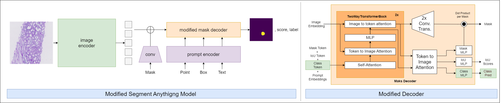

# Multiclass Segmentation of Kidney Tissue using the Segment Anything Model

This repository contains the code for a modified version of the Segment Anything Model (SAM) to obtain labeled segmentations of tissue features in kidney tissue. The model is trained on the classes: tubulus proximal, tubulus distal, tubulus atrophy, glomerulus, sclerotic glomerulus and vessels. 

