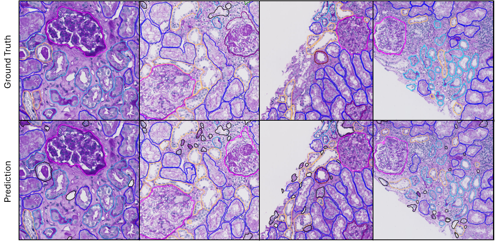

# Multiclass Segmentation of Kidney Tissue using the Segment Anything Model

This repository contains the code for a modified version of the Segment Anything Model (SAM) to obtain labeled segmentations of tissue features in kidney tissue. The model is trained on the classes: tubulus proximal, tubulus distal, tubulus atrophy, glomerulus, sclerotic glomerulus and vessels. 


We were able to obtain the following results: 



## Environment

To replicate the exact environment we provide an environment.yaml file containing the specifications of the required packages and their versions. Here are the steps to install an environment from a YAML file using Conda:

1. **Ensure Conda is Installed**: Make sure you have Conda installed on your system. Conda typically comes with Anaconda or Miniconda distributions. You can also install it separately.

2. **Navigate to the Directory**: Open a terminal or Anaconda Prompt and navigate to the directory containing the YAML file you want to use to create the environment.

3. **Activate Conda**: If you haven't already activated the base environment, activate Conda by running:
   ```bash
   conda activate base

4. **Creat Environment**: create environment using:
```
conda env create -f environment.yml
```

## Data Preperation

The dataset class is setup in such a way that it expects the data directory to contain one folder per slide which has a tissue mask of the cortex, the ground truth annotations as a geojson file obtained from qupath and the slide which all have the same name accros the folders. So in our case the cortex tissue mask was name "partial_tissue_mask.tiff", the annotations are named "improved_labeled_annotations.geojson" and the slides are name "slides.npdi". We also assume that level 2 results in a 10x magnification of the slides. 
