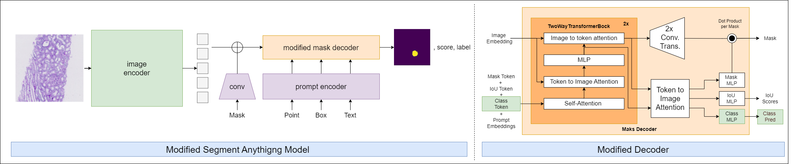
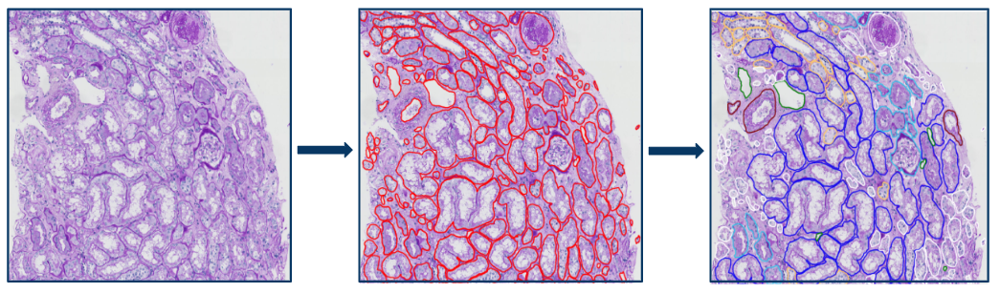
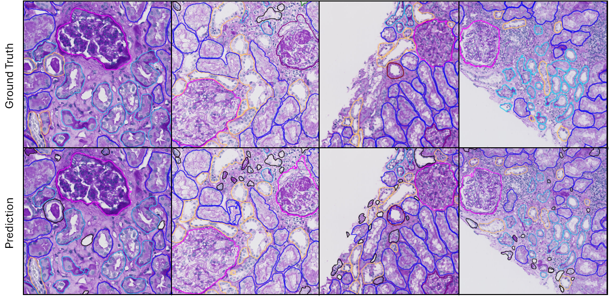

# Multiclass Segmentation of Kidney Tissue using the Segment Anything Model
This repository contains the code for an automatic annotation tool based on the Segment Anything Model (SAM) to speed up dataset creation and a modified version of SAM that is fine-tuned on the created dataset. SAM is modfied to facilitate instance segmentation of the following classes: tubulus proximal, tubulus distal, tubulus atrophy, glomerulus, sclerotic glomerulus and vessels. 



The figure below shows the annotation tool could be used to speed up dataset creation. The middle image shows the annotations obtained using SAM after which the annotatations can be improved and labeled to obtain a dataset that can be seen in the right image.  



The results that can be obtained with the modified version of SAM can be seen in the image below.   



## Environment

To replicate the exact environment we provide an environment.yaml file containing the specifications of the required packages and their versions. Which can be used as follows to create an environment:

    ```bash
    conda env create -f environment.yml
    ```

## Data annotation using SAM

To create annotations for slides using our annotation tool the tissue_annotation.py file should be used. To use this code all the slides should either be in the data directory or each slide should have its own folder within the data directory containing the the slide.  

## Data Preparation and Training

To train the model the dataset class expects a data directory that has a folder per sample where each folder contains the slide and the ground truth annotations which should be a geojson file, resulting in the following folder structure:

- data_dir
    - Sample 1
        - slide.ndpi
        - improved_labeled_annotations.geojson
    - Sample 2
        - ...

The dataset should work with slides from the various scanners that openslide supports, we do assume that level 2 corresponds to a 10x magnification which we use for training the model. 

To train the model use the run_train.py file which you provide the configuration yaml file from the configuration folder. 

## Inference

Inference can be performed with the run_inferece.py file by providing a directory with the slides which again can be one folder with all the slides or a folder with seperate folders for each slide. 